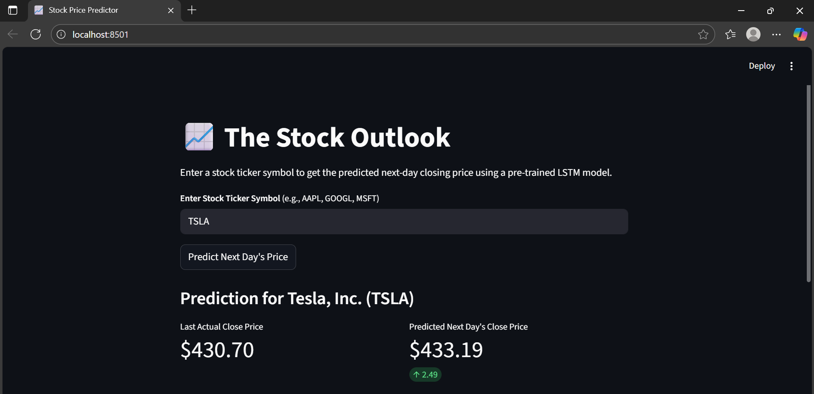
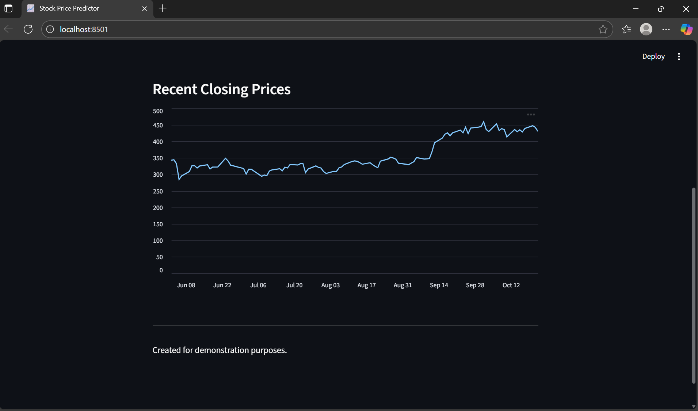

# Stock Price Prediction App

This is an interactive **Stock Price Forecasting Web App** built using **Streamlit** and **LSTM-based deep learning models**.  
The app predicts future stock prices based on historical data and displays both the **predicted value** and **visual graph** for better insight.

---

## Features

- LSTM-based model for stock price forecasting  
- Interactive Streamlit interface  
- Graph visualization  
- Search and select your desired stock symbol  
- Trained using historical market data (Yahoo Finance)

---

## Demo Screenshots

### 1. Choose Stock & Display Predicted Price


### 2. Visualize Predicted vs Actual Prices


---

## Tech Stack

| Component | Technology |
|------------|-------------|
| Frontend | Streamlit |
| Backend | Python |
| Model | LSTM (TensorFlow / Keras) |
| Data Source | Yahoo Finance |
| Visualization | Matplotlib / Plotly |

---

## Installation & Setup

Follow these steps to run the app locally:

```bash
# 1. Clone this repository
git clone https://github.com/manasi210772/stock-prediction.git

# 2. Navigate to the project directory
cd stock-prediction

# 3. (Optional) Create a virtual environment
python -m venv venv
venv\Scripts\activate  # On Windows

# 4. Install dependencies
pip install -r requirements.txt

# 5. Run the Streamlit app
streamlit run app.py
